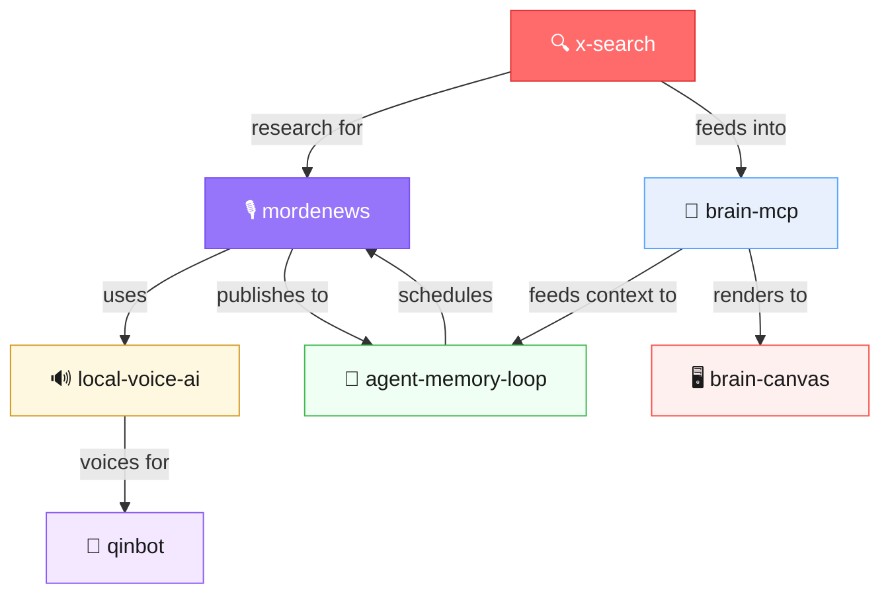

# x-search

**Search X/Twitter from your terminal — real-time, via Grok. No Twitter API key needed.**

<p align="center">
  
</p>

<p align="center"><i>⬆️ Auto-playing preview — <a href="https://github.com/mordechaipotash/x-search/raw/main/assets/demo.mp4">click here for full video with audio</a></i></p>

151 lines of bash. One dependency you already have (`curl`, `jq`). Searches live X/Twitter posts through Grok's native X search on [OpenRouter](https://openrouter.ai). Returns handles, post text, direct links, timestamps, and engagement metrics.

```
$ x-search "mass layoffs tech 2026"

1. @kateclark · Kate Clark · Feb 14, 2026
   "Stripe just laid off another 300 people. That's 3 rounds in 18 months..."
   🔗 https://x.com/i/status/1890421837492...
   ❤️ 4.2K  🔁 1.8K  👁 890K

2. @pacaborern · Patrick Collison · Feb 14, 2026
   "Difficult decisions. We're restructuring to focus on AI-native payments..."
   🔗 https://x.com/i/status/1890418293741...
   ❤️ 12K  🔁 3.1K  👁 2.4M
...

📎 Sources:
  • https://x.com/i/status/1890421837492...
  • https://x.com/i/status/1890418293741...

---
💰 Cost: $0.006 | Tokens: 847 in / 1203 out | Searches: 4
🤖 Model: x-ai/grok-4.1-fast:online
```

**~$0.006 per search.** Not $100/month. Not rate-limited. No approval process. No OAuth. Just `curl` and a Grok model that can natively read X.

---

## Why This Exists

Twitter's API costs **$100/month** minimum for basic search. Requires approval, OAuth setup, rate limit management, and 200 lines of Python just to authenticate.

Grok models on OpenRouter have **native X/Twitter search built in**. The `:online` model suffix enables both web search and X search. This script is just a clean wrapper around that capability.

**You don't need a Twitter API key. You don't need a Twitter developer account. You don't need to apply for anything.**

---

## Install

```bash
curl -fsSL https://raw.githubusercontent.com/mordechaipotash/x-search/main/x-search -o ~/.local/bin/x-search
chmod +x ~/.local/bin/x-search
```

Or clone:

```bash
git clone https://github.com/mordechaipotash/x-search.git
cp x-search/x-search ~/.local/bin/
```

### Requirements

- **bash** (4.0+)
- **curl**
- **jq**
- **OpenRouter API key** — [get one here](https://openrouter.ai/keys) (free to sign up, pay-per-use)

```bash
export OPENROUTER_API_KEY="sk-or-v1-your-key-here"
```

Add to your `~/.bashrc` / `~/.zshrc` to persist.

---

## Usage

```bash
# Basic search
x-search "AI agents"

# Date range
x-search "bitcoin ETF" --from 2026-02-01 --to 2026-02-15

# Filter by handles
x-search "GPU shortage" --handles @elonmusk,@sama

# Use a different model
x-search "topic" --model x-ai/grok-4:online

# Raw JSON output (includes annotations with tweet URLs)
x-search "topic" --raw

# Combine everything
x-search "funding announcement" --from 2026-01-01 --handles @ycombinator --model x-ai/grok-4:online
```

### Flags

| Flag | Description | Example |
|------|-------------|---------|
| `--from` | Start date filter | `--from 2026-01-01` |
| `--to` | End date filter | `--to 2026-02-15` |
| `--handles` | Filter by X handles (comma-separated) | `--handles @elonmusk,@sama` |
| `--model` | Override Grok model | `--model x-ai/grok-4:online` |
| `--raw` | Output raw JSON response | |
| `--help` | Show usage | |

### Environment Variables

| Variable | Default | Description |
|----------|---------|-------------|
| `OPENROUTER_API_KEY` | *(required)* | Your OpenRouter API key |
| `XSEARCH_MODEL` | `x-ai/grok-4.1-fast:online` | Default model |
| `XSEARCH_MAX_TOKENS` | `2000` | Max response tokens |

---

## How It Works

```
  x-search "query"
       │
       ▼
  Build prompt with date/handle filters
       │
       ▼
  POST to OpenRouter API
  (model: grok-4.1-fast:online)
       │
       ▼
  Grok searches X/Twitter natively
  (the :online suffix enables this)
       │
       ▼
  Returns posts with handles, text,
  links, dates, engagement metrics
       │
       ▼
  Extracts annotations (direct tweet URLs)
  Shows cost breakdown
```

The key insight: **xAI's Grok models have native access to X/Twitter's firehose.** When you use the `:online` suffix on OpenRouter, Grok performs real X searches — not web scraping, not API calls — actual platform-level search. This is the same search that powers Grok on x.com.

OpenRouter charges $5 per 1,000 search invocations. Grok typically makes 3-6 searches per query, so the search cost is ~$0.015-0.03 per query plus token costs.

---

## Models

| Model | Input | Output | Search | Per Query | Speed | Quality |
|-------|-------|--------|--------|-----------|-------|---------|
| `x-ai/grok-4.1-fast:online` | $0.20/M | $0.50/M | $5/1K | **~$0.03** | ⚡ Fast | Good |
| `x-ai/grok-4-fast:online` | $0.20/M | $0.50/M | $5/1K | **~$0.03** | ⚡ Fast | Good |
| `x-ai/grok-3-mini:online` | $0.30/M | $0.50/M | $5/1K | **~$0.03** | ⚡ Fast | OK |
| `x-ai/grok-4:online` | $3.00/M | $15.00/M | $5/1K | **~$0.10** | 🐢 Slower | Best |

**Default: `x-ai/grok-4.1-fast:online`** — best balance of speed, cost, and quality.

Use `grok-4:online` when you need deeper analysis or more nuanced results.

---

## Why Not the Twitter API?

| | x-search | Twitter API (Basic) | Twitter API (Pro) |
|---|---------|-------------------|------------------|
| **Cost** | ~$0.03/query | $100/month | $5,000/month |
| **Rate limit** | None | 10K tweets/month | 1M tweets/month |
| **Auth** | API key (instant) | OAuth 2.0 + approval | OAuth 2.0 + approval |
| **Setup time** | 30 seconds | Days to weeks | Days to weeks |
| **Code** | 151 lines bash | 200+ lines Python | 200+ lines Python |
| **Dependencies** | curl, jq | tweepy, requests, oauth | tweepy, requests, oauth |
| **Approval required** | No | Yes (developer account) | Yes (developer account) |
| **Real-time** | Yes (Grok indexes fast) | Yes | Yes |

Twitter's API exists for building apps that need structured, guaranteed data access. If you just want to **search Twitter from your terminal**, this is simpler by every metric.

---

## Use Cases

- **Monitoring** — track mentions of your brand, product, or competitors
- **Research** — find what people are saying about a topic right now
- **Sentiment analysis** — gauge reaction to news/events in real-time
- **Due diligence** — check someone's public posting history
- **Trend tracking** — see what's trending before it hits the news
- **Competitive intelligence** — track competitor announcements
- **Pipeline input** — pipe `--raw` JSON into your own tools

---

## Tips

- Ask for more posts in your query: `x-search "AI agents, show me 20 posts"`
- For trending topics: `x-search "what's trending in AI today"`
- For sentiment: `x-search "reactions to OpenAI announcement"`
- Pipe raw JSON for scripting: `x-search "topic" --raw | jq '.choices[0].message.content'`
- Response time is ~30-45 seconds (Grok searches, reads, then synthesizes)

---

## 🔗 Part of the AI Agent Ecosystem

x-search is the research layer in a modular AI agent stack — feeding real-time X/Twitter intelligence into podcasts, memory systems, and autonomous agents.



| Repo | What | Stars |
|------|------|-------|
| [brain-mcp](https://github.com/mordechaipotash/brain-mcp) | Memory — 25 MCP tools, cognitive prosthetic | ⭐ 17 |
| [brain-canvas](https://github.com/mordechaipotash/brain-canvas) | Visual display for any LLM | ⭐ 11 |
| [local-voice-ai](https://github.com/mordechaipotash/local-voice-ai) | Voice — Kokoro TTS + Parakeet STT, zero cloud | ⭐ 1 |
| [agent-memory-loop](https://github.com/mordechaipotash/agent-memory-loop) | Maintenance — cron, context windows, STATE.json | ⭐ 1 |
| **[x-search](https://github.com/mordechaipotash/x-search)** | **This repo** — search X/Twitter via Grok | 🆕 |
| [mordenews](https://github.com/mordechaipotash/mordenews) | Automated daily AI podcast | 🆕 |
| [qinbot](https://github.com/mordechaipotash/qinbot) | AI on a dumb phone — no browser, no apps | ⭐ 1 |

---

## License

MIT — see [LICENSE](LICENSE)

---

**Built by [Mordechai Potash](https://github.com/mordechaipotash)**


---

## How This Was Built

Built by [Steve [AI]](https://github.com/mordechaipotash), Mordechai Potash's agent. 100% machine execution, 100% human accountability.

> The conductor takes the bow AND the blame. [How We Work →](https://github.com/mordechaipotash/mordechaipotash/blob/main/HOW-WE-WORK.md)
